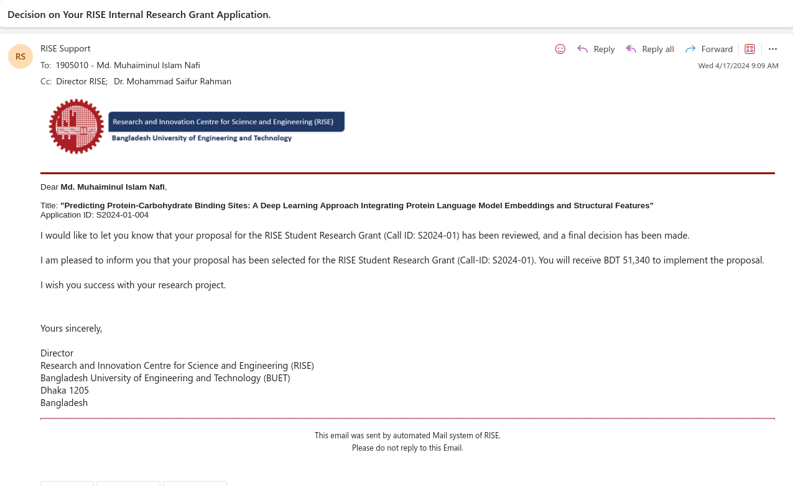
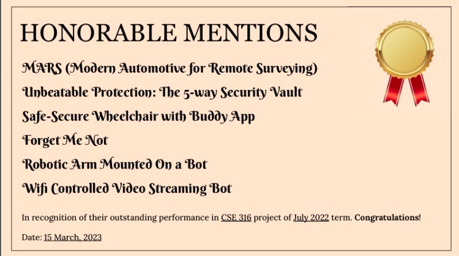

# Hello 👋😊, I am Md Muhaiminul Islam Nafi

### Lecturer in Computer Science and Engineering \| Researcher in Bioinformatics and Machine Learning

### Connect with me

### About me

**Name**: Md Muhaiminul Islam Nafi

**Email**: nafiislam964@gmail.com

**Phone**: (+880) 1704953445

I am Md Muhaiminul Islam Nafi, a Lecturer in the Department of Computer
Science and Engineering at United International University (UIU), Dhaka.
I completed my B.Sc. in Computer Science and Engineering from Bangladesh
University of Engineering and Technology (BUET) with a CGPA of
3.97/4.00.

My primary research interests are bioinformatics and machine learning,
particularly protein and RNA language models, computational biology,
deep learning, ensemble learning, and biological sequence analysis. My
research includes published work on glycosylation-site prediction,
succinylated lysine prediction, nitrogenase activity modeling,
protein--carbohydrate binding-site prediction, RNA modification
prediction, and bladder-cancer tissue classification.

Alongside research, I have teaching experience at UIU and served as an
Adjunct Lecturer in the Department of CSE at BUET from November 2025 to
April 2026. I am also interested in software engineering, web
development, cloud deployment, and applied machine-learning systems.

### My portfolio website

-   [Website](https://nafiislam.github.io/)

### Education

-   #### Bangladesh University of Engineering and Technology (BUET), Dhaka, Bangladesh

    **B.Sc. in Computer Science and Engineering** --- **CGPA:
    3.97/4.00**\
    **2020--2025**

-   #### Notre Dame College, Dhaka, Bangladesh

    **HSC** --- **GPA: 5.00/5.00**\
    **2017--2019**

-   #### Motijheel Govt. Boys' High School, Dhaka, Bangladesh

    **SSC** --- **GPA: 5.00/5.00**\
    **2015--2017**

### Work Experience

-   #### United International University (UIU), Dhaka, Bangladesh

    **Lecturer --- Department of Computer Science and Engineering**\
    **2025--Present**

-   #### Bangladesh University of Engineering and Technology (BUET), Dhaka, Bangladesh

    **Adjunct Lecturer --- Department of Computer Science and
    Engineering**\
    **November 2025 -- April 2026**

### Skills

### Profile Summary

  
 

#### Programming Languages

#### Assembly Languages

-   x86
-   MIPS

#### Frontend Development

#### Backend Development

#### AI/ML/Visuals

#### Database

#### Tools

#### Game development

#### Content Management

### Skill Summary

-   **Programming Languages:** Python, JavaScript, TypeScript, C, C++,
    Assembly (x86, MIPS), Bash, Java, LaTeX
-   **Web Development:** HTML, CSS, Express, React, Svelte, Django,
    Next.js, Figma, Docker, Spring Boot, LangChain
-   **Machine Learning:** Matplotlib, NumPy, Pandas, Scikit-learn,
    PyTorch
-   **Tools and Technologies:** Design Patterns, Git, Microservices
    Architecture, Swagger API, Postman, MISP, Markdown, MS Azure Cloud
    VM
-   **Databases:** MySQL, PostgreSQL, Oracle, Prisma ORM
-   **Content Management:** WordPress
-   **Game Development:** Pygame, Unity
-   **Others:** Bison, Flex, Selenium, Beautiful Soup, JavaFX, ATmega32

### Research Experience

**Predicting C- and S-linked Glycosylation Sites from Protein Sequences
Using Protein Language Models**\
*(Published in a Q1 journal)*\
Developed a hybrid deep-learning architecture to predict C- and S-linked
glycosylation sites from protein sequences using protein language model
embeddings and contextual information.\
*Article:*
[ScienceDirect](https://www.sciencedirect.com/science/article/abs/pii/S0010482525003075)

------------------------------------------------------------------------

**StackGlyEmbed: Prediction of N-linked Glycosylation Sites Using
Protein Language Models**\
*(Published in a Q1 journal)*\
Proposed StackGlyEmbed, a model that predicts N-linked glycosylation
sites from protein sequences by leveraging protein language models with
window and per-residue features.\
*Article:* [Bioinformatics
Advances](https://academic.oup.com/bioinformaticsadvances/advance-article/doi/10.1093/bioadv/vbaf146/8177143)

------------------------------------------------------------------------

**ResLysEmbed: A ResNet-Based Framework for Succinylated Lysine Residue
Prediction Using Sequence and Language Model Embeddings**\
*(Published in a Q1 journal)*\
Developed a hybrid deep-learning architecture incorporating protein
language models to identify succinylated lysine residues.\
*Article:* [Bioinformatics
Advances](https://academic.oup.com/bioinformaticsadvances/advance-article/doi/10.1093/bioadv/vbaf198/8239949)

------------------------------------------------------------------------

**NFEmbed: Modeling Nitrogenase Activity via Classification and
Regression with Pretrained Protein Embeddings**\
*(Published in a Q1 journal)*\
Developed stacking ensemble models to predict microbial strains with
high nitrogenase potential using protein language model embeddings and
achieved superior performance over state-of-the-art methods.\
*Article:* [Bioinformatics
Advances](https://academic.oup.com/bioinformaticsadvances/advance-article/doi/10.1093/bioadv/vbaf204/8240278)

------------------------------------------------------------------------

**Predicting Protein-Carbohydrate Binding Sites: A Deep Learning
Approach Integrating Protein Language Model Embeddings and Structural
Features**\
*(Published in a Q1 journal --- Undergraduate Thesis)*\
Designed a novel deep-learning architecture that integrates protein
language model embeddings with structural features for predicting
protein-carbohydrate binding sites.

------------------------------------------------------------------------

**Predicting RNA 5-Hydroxymethylcytosine Modification with Deep Learning
Models Using RNA Language Model Embeddings**\
*(Published in a Q1 journal)*\
Designed a dual-branch deep-learning model architecture to predict RNA
5-Hydroxymethylcytosine modifications using RNA language models and
extracted biological interpretations.

------------------------------------------------------------------------

**DeepBCTPred: Deep Learning-Based Prediction of Bladder Cancer Tissues
from Endoscopic Images**\
*(Published in a Q1 journal --- CSE472 Machine Learning Project)*\
Developed a pipeline to generate new images and a novel genetic
algorithm to effectively select images from them, combining handcrafted
features with learned features from convolutional neural networks.

------------------------------------------------------------------------

**Prediction of Protein-Carbohydrate Binding Sites from Protein Primary
Sequence**\
*(Preprint)*\
Developed StackCBEmbed, an ensemble machine-learning model for effective
classification of protein-carbohydrate binding interactions at the
residue level, integrating sequence-based features with pretrained
transformer-based protein language model embeddings.\
*Preprint:*
[bioRxiv](https://www.biorxiv.org/content/10.1101/2024.02.09.579590v1)

------------------------------------------------------------------------

**Expanded Strategy Space Improves Nash Solution by Increased Degrees of
Freedom**\
*(Manuscript in Preparation --- CSE462 Algorithm Engineering Project)*\
Investigated algorithmic improvements for solving the Nash Equilibrium
problem, focusing on approximation algorithms and meta-heuristic
approaches such as replicator dynamics to enhance computational
efficiency.

------------------------------------------------------------------------

**OptEmbed: A Multi-Task Framework Using Protein Language Model
Embeddings and Sequential Features to Predict Optimal Temperature,
Melting Temperature, and Optimal pH**\
*(Manuscript in Preparation)*\
Introduced OptEmbed, a protein language model-based framework
integrating sequential features to predict enzyme parameters (Topt, Tm,
and pHopt) with improved accuracy and interpretability over
state-of-the-art methods.

### Awards and Honors

**BUET RISE Grant**\
RISE Student Research Grant **\[No. S2024-01-004\]** --- **BDT 61,340**
*(Grant received)*

------------------------------------------------------------------------

**IAR, UIU Research Grant**\
Grant Reference: **UIU-IAR-02-2025-SE-11** --- **BDT 4,98,412**

------------------------------------------------------------------------

**Dean's List and University Merit List**\
Recipient of both scholarships for academic excellence.

------------------------------------------------------------------------

**Honorable Mention**\
MicroProcessor and MicroController project: **Unbeatable Protection: The
5-way Security Vault**

------------------------------------------------------------------------

**Contribution as the Trainer**\
**Building Capacity in Structural Biology and Beyond: AlphaFold Hands-on
Workshop for Bangladesh**

### Projects

#### OnCampus --- BUET Student Hub

*CSE408 --- Software Project*

OnCampus is a platform for BUET students to manage academic and
extracurricular activities. It allows users to post academic updates,
conduct polls, access notices, and find information on club events,
competitions, and seminars in one place.

-   **Frontend:** Next.js, Tailwind CSS, Material Tailwind, jodit-react,
    react-pdf, react-photo-sphere-viewer, TypeScript
-   **Backend:** Node.js, Express, Microservice Architecture, Prisma
    ORM, Helmet, JWT, Keycloak, NextAuth.js
-   **Database & Storage:** PostgreSQL on Supabase, Edgestore
-   **Integration:** Google Calendar through Google Cloud API
-   **Deployment:** MS Azure Virtual Machines, Supabase, Docker
    (Keycloak), SSL certificate, Postman API documentation
-   [Backend](https://github.com/nafiislam/OnCampus)
-   [Frontend](https://github.com/nafiislam/OnCampusFrontEnd)

#### MooMarket --- Online Marketplace Platform

*CSE326 --- ISD Project*

MooMarket is an online marketplace where sellers can advertise products
such as cattle and meat with location-based display options. Buyers can
filter and purchase products, place order posts, and rate sellers.
Sellers can accept orders and participate in auctions, with priority
points assigned based on reviews and ratings.

-   **Design Artifacts:** BPMN diagrams, mock UI, class diagrams, ERD
    diagrams, sequence diagrams, collaboration diagrams, and state
    diagrams
-   **Tech Stack:** JavaScript (Node.js, Vanilla JS), Express, HTML,
    EJS, PostgreSQL, Git, GitHub, npm, Render
-   [Backend & Frontend](https://github.com/nafiislam/MooMarket)

#### AniMatrix --- Content Platform

*CSE216 --- Database Project*

AniMatrix is a web-based content wiki that allows users to interact with
content through voting, watchlists, reading lists, forums, and chat.

-   **Tech Stack:** JavaScript (Node.js, Vanilla JS), Express, HTML,
    EJS, Oracle DB, Git, GitHub, npm
-   [Backend & Frontend](https://github.com/nafiislam/AniMatrix)

#### MISP Exploration and Application

*CSE406 --- Security Project*

Explored MISP features and integrated MISP with Hive. Used the MISP REST
API through the PyMISP automation library and developed a browser
extension to check vulnerabilities through MISP.

-   **Technologies:** Python, JavaScript, MISP
-   [GitHub](https://github.com/nafiislam/CSE-406-Automation-Codes)
-   [YouTube](https://www.youtube.com/watch?v=gCwxrJLh0js)

#### Pacman Game

*CSE102 --- iGraphics Project*

Developed a Pacman game using the OpenGL-based iGraphics library,
implementing classic Pacman mechanics along with additional features.

-   **Technologies:** C, C++, Object-Oriented Programming (OOP),
    iGraphics
-   [GitHub](https://github.com/nafiislam/pacman-code)

#### Unbeatable Protection: The 5-way Security Vault

*CSE316 --- MicroProcessor and MicroController Project*

Developed a real-world implementable five-way locker security system
using password, RFID, face, voice, and fingerprint verification.

-   **Technologies:** Python, Arduino, EEE
-   [GitHub](https://github.com/nafiislam/microproject_final)
-   [YouTube](https://www.youtube.com/watch?v=CM5BSOvdsKw)

#### Motif Search

*CSE463 --- Bioinformatics Project*

Implemented Randomized Motif Search and Gibbs Sampler Motif Search along
with their modifications. Also explored MEME and MEMEChIP for motif
discovery.

-   **Technologies:** Python
-   [GitHub](https://github.com/nafiislam/bioinfo-ct-assignment)

#### Football Club Manager --- Desktop App

*CSE108 --- JavaFX Project*

Developed a desktop application with a JavaFX-based UI using
multithreaded socket programming for client-server communication.

-   **Technologies:** Java, JavaFX, Multithreading, Socket Programming
-   [Part 1 GitHub](https://github.com/nafiislam/Java-Project-part-1)
-   [Part 2 GitHub](https://github.com/nafiislam/Java-Project-part-2)

### Certificates

-   **Perfect Attendance Certificate** --- Notre Dame College, Dhaka ---
    Issued May 2020
-   **Certificate in National Skill Standard Basic Course Examination,
    2015** --- Bangladesh Technical Education Board --- Issued September
    2015

### Reference

**Dr. Mohammad Saifur Rahman**\
Professor, Department of Computer Science and Engineering\
Bangladesh University of Engineering and Technology (BUET)\
Email: mrahman@cse.buet.ac.bd\
Phone: +8801715010010
